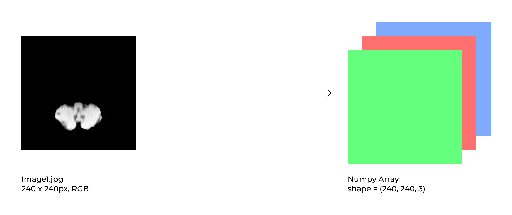
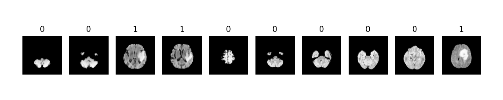
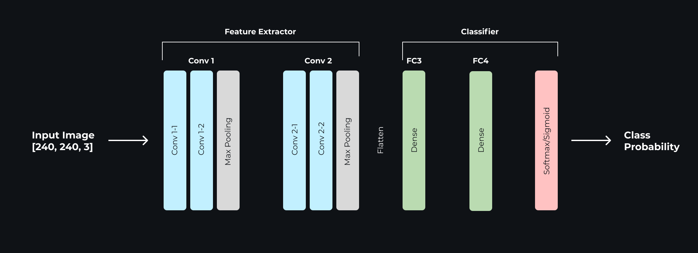
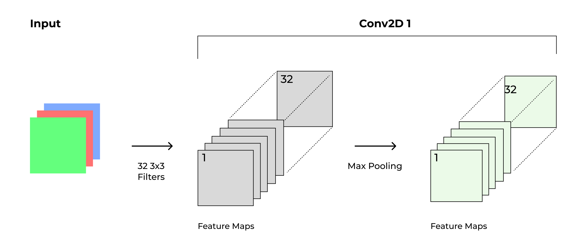
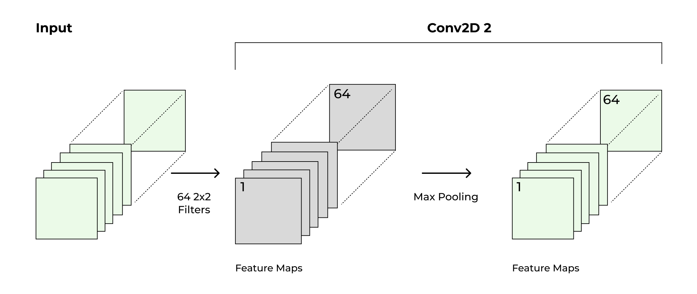
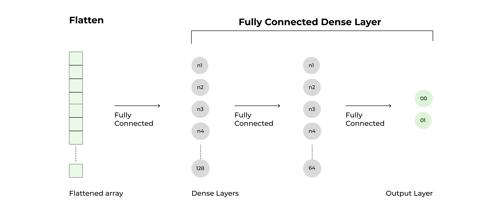
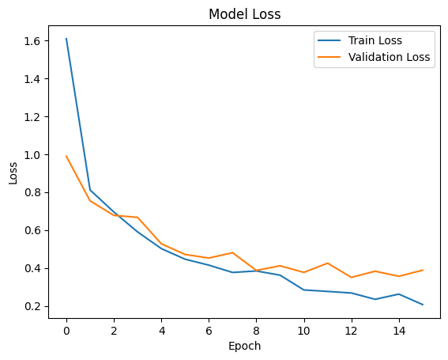
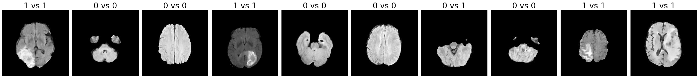

# Brain Tumor Classification

This repository contains code and data for a brain tumor classification project. The goal of this project is to classify brain scans as either having a tumor (positive) or not having a tumor (negative) using a Convolutional Neural Network (CNN).

A Convolutional Neural Network (CNN) is a type of deep learning algorithm specifically designed for processing structured grid data such as images. CNNs are particularly effective for image recognition and classification tasks due to their ability to automatically learn spatial hierarchies of features through the use of convolutional layers.

## Table of Content

- [Project Structure](#project-structure)
- [Dataset](#dataset)
- [Model](#model)
- [Analysis](#analysis)
- [Setup: Clone Repository](#setup-clone-repository)
- [Docker Image](#docker-image-instructions)
- [Conclusion](#conclusion)


## Project Structure

The repository is structured as follows:

- `data/`: Contains the dataset used for model training and evaluation
  - `train`: Contains train_data.npz generated by  `src/preprocessing.py`
  - `test`: Contains test_data.npz generated by  `src/preprocessing.py`

- `model/`: Contains the saved model after training.

- `notebooks/`: Contains the notebook used in coming up with the best model architecture

- `src/`: Contains data and scripts for data preparation, preprocessing and model development
   - `images/`: Contains brain scan images.
   - `csv/`: Contains CSV files with metadata and labels for the brain scan images.
   - `processed_data/`: Contains processed data saved as .npz files.

      
      Snippet: Images converted to Numpy Arrays

      
      Snippet: First 10 Images and their labels


   - `preprocessing.py`: Script for preprocessing the image data.
   - `model.py`: Script for building, training, saving, loading, and evaluating the CNN model.
   - `prediction.py`: Script for predicting tumor presence in images using the trained model.

- `app.py`: This app.py file sets up a FastAPI application to facilitate the prediction and retraining of a brain tumor classification model. The application supports uploading images for tumor prediction and retraining the model with new data.

   - `API Endpoints`
      - `Root Endpoint ('/')` - GET Method : Returns a welcome message and instructions to use the documentation.
      
      Response
      ```json
      {
         "message": "Welcome to the Brain Tumor Classification Model, use '<url>/docs' for documentation"
      }
      ```

      - `Prediction Endpoint ('/predict')` - POST Method : Accepts an image file and returns a prediction on whether the image contains a tumor.

      Request: file (UploadFile): The image file to be analyzed.

      Response
      ```json
      {
         "prediction": {
            "class": "Tumor" or "No Tumor",
            "probability": <probability_value>
         }
      }
      ```

      - `Retraining Endpoint (/retrain)` - POST Method : Retrains the model with new data provided in the request body.

         - Request:

            - `image_dir (str)`: Directory containing the images for training.
            - `target_dir (str)`: Directory containing the target labels.
            - `target_file (str)`: CSV file with target labels.
            - `data_dir (str)`: Directory to save processed data.
            - `epochs (int)`: Number of epochs for training.
            - `npz_filename (str)`: Filename for the processed data saved in .npz format.

      Response
      ```json
      {
         "status": "Model retraining complete",
         "metrics": {
            "loss": <loss_value>,
            "accuracy": <accuracy_value>,
            "val_loss": <val_loss_value>,
            "val_accuracy": <val_accuracy_value>
         }
      }
      ```
   
      - `Evaluate Endpoint (/evaluate)` - POST Method : Evaluates the model

       Response
      ```json
      {
         "evaluation" :{
            "accuracy": <accuracy_value>,
            "classification_report": <accuracy_value>
         }
      }
      ```


## Dataset

The dataset consists of 3762 brain scan images. The target labels are provided in `BrainTumor.csv` and have two classes:
- `0`: Absence of a tumor
- `1`: Presence of a tumor

The images were preprocessed and saved as numpy arrays in an `.npz` file for efficient loading and training.

## Model

The model used for this project is a Convolutional Neural Network (CNN) implemented using TensorFlow. The architecture of the final model is as follows:



1. **Convolutional Layer 1:**
   - 32 filters of size 3x3
   - Activation: ReLU
   - Max Pooling: 2x2



2. **Convolutional Layer 2:**
   - 64 filters of size 3x3
   - Activation: ReLU
   - Max Pooling: 2x2



3. **Flatten Layer:**

4. **Fully Connected Dense Layer 1:**
   - 128 units
   - Activation: ReLU

5. **Fully Connected Dense Layer 2:**
   - 64 units
   - Activation: ReLU

6. **Output Layer:**
   - 2 units
   - Activation: Softmax



### Why These Components?

- **Convolutional Layers (Kernels):** Convolutional layers use filters (kernels) to scan through the input image and detect patterns such as edges, textures, and shapes. Each filter specializes in recognizing a specific feature, which helps the network learn spatial hierarchies of features in the images.

- **Max Pooling:** Max pooling layers reduce the spatial dimensions of the feature maps, retaining only the most important features while reducing computational load and controlling overfitting. By taking the maximum value in each patch of the feature map, max pooling also introduces a form of translation invariance, which is beneficial for image recognition.

- **ReLU Activation:** The Rectified Linear Unit (ReLU) activation function introduces non-linearity into the model, allowing it to learn complex patterns. ReLU also helps in preventing the vanishing gradient problem, where gradients become too small for effective training, by allowing gradients to flow more effectively during backpropagation.

- **Softmax Activation:** The softmax function is used in the output layer for multi-class classification. It converts the logits (raw predictions) into probabilities, providing a probability distribution over the classes, which makes it easier to interpret the model's predictions.

### Regularization and Training

- **L2 Regularization:** Applied to prevent overfitting by penalizing large weights.
- **Early Stopping:** Implemented to stop training when the validation performance stops improving.
- **Epochs:** The model completed training with 20 epochs.

## Training Performance

- **Accuracy:** 97.89%
- **Loss:** 0.1409

These metrics indicate that the model learned the training data well, achieving high accuracy and low loss.

## Validation Performance

- **Validation Accuracy:** 88.70%
- **Validation Loss:** 0.4164



The validation accuracy is slightly lower than the training accuracy, which is typical and indicates good generalization. The higher validation loss compared to training loss is expected but still remains relatively low.

## Analysis

- **L2 Regularization:** Helped in penalizing large weights and encouraged the model to learn more generalizable features.

The results suggest that the CNN achieved good performance on the training data and generalizes well to unseen data. Further evaluation and testing might be needed to confirm the model's performance on completely new datasets.

## 10 Predictions



## Error Analysis 

[Explore](erroranalysis.md)

## Setup: Clone Repository

1. **Clone the repository**:
    ```bash
    git clone https://github.com/kayc0des/brain_tumor_model_.git
    cd brain_tumor_model
    ```

2. **Create a virtual environment**:
    ```bash
    python -m venv venv
    source venv/bin/activate   # On Windows use `venv\Scripts\activate`
    ```

3. **Install the required packages**:
    ```bash
    pip install -r requirements.txt
    ```

4. **Run the FastAPI application**:
    ```bash
    uvicorn app:app --reload --host 0.0.0.0 --port 8000
    ```

## Docker Image Instructions

1. **Install Docker:** If you do not have docker installed, visit [Docker's official website](https://www.docker.com/) to install docker.

2. **Log in to Docker Hub:** This is optional provided the repository is public
   ```bash
   docker login
   ```

3. **Pull the Docker Image:** Pull the image from Docker Hub using the image name
   ```bash
   docker pull kayc0des/brain_tumor_model:latest
   ```

4. **Run the Docker Container:** Start a container from the image.
   ```bash
   docker run -p 8000:8000 yourusername/brain_tumor_model:latest
   ```
   This command maps port 8000 on the host machine to port 8000 on the container, which is where your FastAPI app is running.

5. **Access the FastAPI Application:** Once the container is running, access the FastAPI application by navigating to:
   ```arduino
   http://localhost:8000
   ```
   or
   ```arduino
   http://<host-ip>:8000
   ```

6. **Access Swagger UI:** To test the API endpoints,visit the Swagger UI at:
   ```arduino
   http://<host-ip>:8000/docs
   ```

7. **Test the Endpoints:** [Instructions](#project-structure)


## Conclusion

This brain tumor classification project demonstrates the effectiveness of CNNs in medical image analysis. With high training accuracy and good validation performance, the model shows promise for real-world application in brain tumor detection. Further testing and validation on larger datasets could help in improving the model's robustness and reliability.

---

- [kayc0des](https://github.com/kayc0des)
