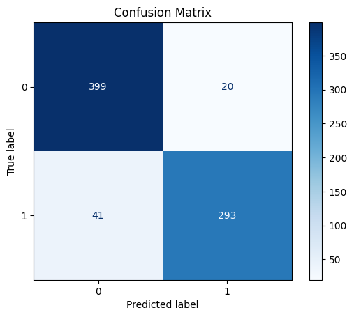

# Confusion Matrix Analysis

The confusion matrix below summarizes the performance of the brain tumor classification model on the validation dataset.

### Components of the Confusion Matrix:

- **True Negatives (TN):** 399
  - These are the instances where the actual class was 0 (absence of a tumor) and the model correctly predicted 0.

- **False Positives (FP):** 20
  - These are the instances where the actual class was 0 (absence of a tumor), but the model incorrectly predicted 1 (presence of a tumor).

- **False Negatives (FN):** 41
  - These are the instances where the actual class was 1 (presence of a tumor), but the model incorrectly predicted 0 (absence of a tumor).

- **True Positives (TP):** 293
  - These are the instances where the actual class was 1 (presence of a tumor) and the model correctly predicted 1.

### Derived Metrics:

1. **Accuracy:**
   \[
   \text{Accuracy} = \frac{TP + TN}{TP + TN + FP + FN} = \frac{293 + 399}{293 + 399 + 20 + 41} = \frac{692}{753} \approx 0.9188 \text{ (91.88%)}
   \]

2. **Precision (for class 1):**
   \[
   \text{Precision} = \frac{TP}{TP + FP} = \frac{293}{293 + 20} = \frac{293}{313} \approx 0.9362 \text{ (93.62%)}
   \]

3. **Recall (Sensitivity, for class 1):**
   \[
   \text{Recall} = \frac{TP}{TP + FN} = \frac{293}{293 + 41} = \frac{293}{334} \approx 0.8772 \text{ (87.72%)}
   \]

4. **F1 Score (for class 1):**
   \[
   \text{F1 Score} = \frac{2 \cdot \text{Precision} \cdot \text{Recall}}{\text{Precision} + \text{Recall}} = \frac{2 \cdot 0.9362 \cdot 0.8772}{0.9362 + 0.8772} \approx 0.906 \text{ (90.6%)}
   \]

5. **Specificity (for class 0):**
   \[
   \text{Specificity} = \frac{TN}{TN + FP} = \frac{399}{399 + 20} = \frac{399}{419} \approx 0.9523 \text{ (95.23%)}
   \]

### Interpretation:
- **High True Negatives and True Positives:** The model is performing well in correctly identifying both classes, especially the absence of a tumor (399 TN) and presence of a tumor (293 TP).
- **False Positives:** The model incorrectly predicted 20 instances as positive (presence of a tumor) when they were actually negative.
- **False Negatives:** The model missed 41 instances where there was a tumor, predicting them as negative.

### Conclusion:
- The model has high accuracy (91.88%), indicating that it is generally performing well.
- The precision and recall are also high (93.62% and 87.72% respectively), which means the model is effective in correctly identifying tumors and has a relatively low rate of false positives.
- The specificity (95.23%) indicates that the model is very good at identifying patients without a tumor.

However, the presence of false negatives (41 cases) is significant in a medical context because missing a diagnosis of a tumor can have serious consequences. Further tuning or using additional data might help to reduce the number of false negatives.
